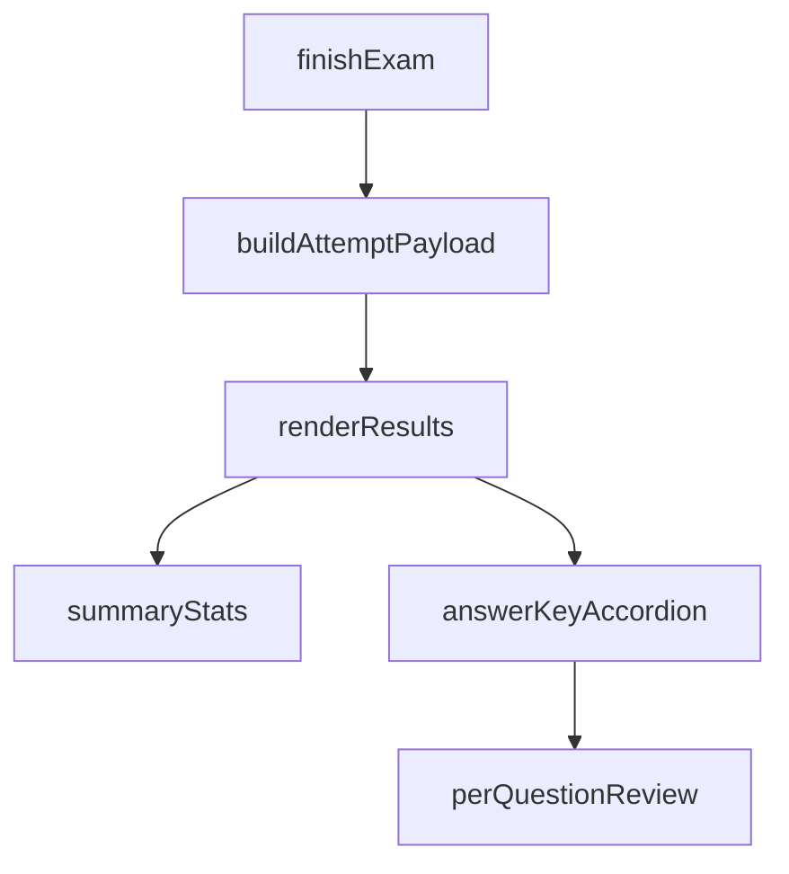

# Results Answer Key Accordion

## Context

[`renderResults`](projects/ccat-simulator/public/app.js) already receives a full attempt payload. Each `payload.items[]` entry already has `stem`, `choices`, `selectedIndex`, `correctIndex`, `isCorrect`, and `area` — no server or schema changes.

Placement matches the red mark in the screenshot: after the by-area list inside `#results-summary`, before `#results-save`.

## Approach

Use a native `
` / `
` block (no new dependencies, keyboard-accessible). Summary label: **Answer key**. Content lists all questions in order.

Per question show:
- Number + area (e.g. `Q1 · numerical`)
- Stem
- Choice list (same rounded-border “chip” look as exam choices)
- Short lines: **Your answer:** … (or `—` if unanswered) and **Correct answer:** …

### Choice highlight rules

| Case | Border | Fill |
|------|--------|------|
| User selected wrong | `--danger` (red) | red tint |
| Correct answer (not selected by user) | `--accent` (green) | green tint |
| User selected correct | `--accent` (green) | blue tint via `--focus` |
| Other / unanswered distractors | default `--border` | default bg |

Implement as CSS modifier classes on review choice rows, e.g.:
- `.review-choice.is-wrong`
- `.review-choice.is-correct`
- `.review-choice.is-correct-selected`

Reuse existing theme tokens in [`styles.css`](projects/ccat-simulator/public/styles.css) (`--danger`, `--accent`, `--focus`). Slightly rounded corners (~8px), matching `.choice`.

## Files to change

1. **[`projects/ccat-simulator/public/app.js`](projects/ccat-simulator/public/app.js)**  
   - Extend `renderResults(payload)` to append the `
` block after `.by-area`.  
   - Add a small `escapeHtml` helper (or build nodes with `textContent`) so stems/choices are safe in `innerHTML`.  
   - Map each item’s indexes to the three highlight classes above.

2. **[`projects/ccat-simulator/public/styles.css`](projects/ccat-simulator/public/styles.css)**  
   - Styles for `.answer-key`, summary/chevron affordance, `.review-question`, and the three `.review-choice` states (border + filled background via `color-mix` like the existing checked choice style).  
   - Keep light/dark themes working via CSS variables only.

No changes to [`server.js`](projects/ccat-simulator/server.js), attempt JSON shape, or test files.

## Defaults

- Accordion **closed** by default (user expands to review).  
- UI copy in **English** (repo policy).  
- Unanswered: no red highlight; correct choice still green border + green fill; “Your answer” shows `—`.
