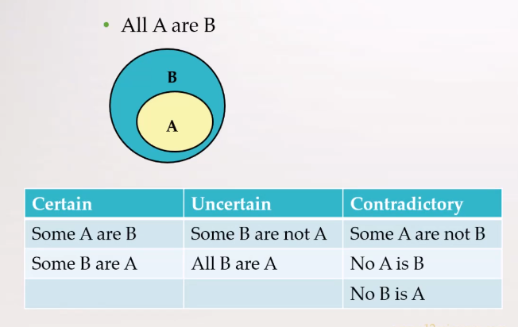
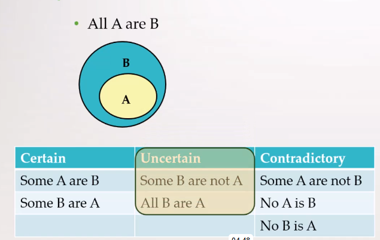
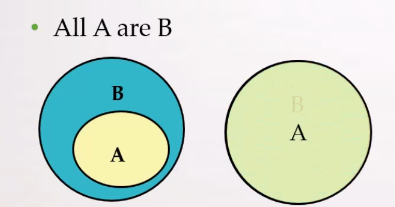
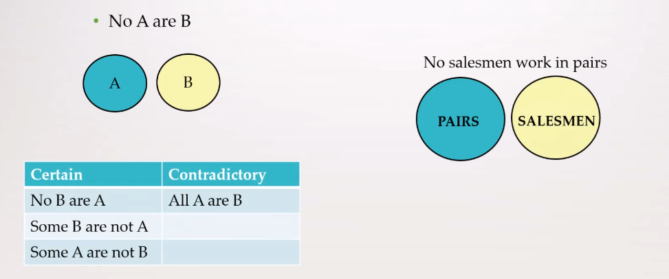
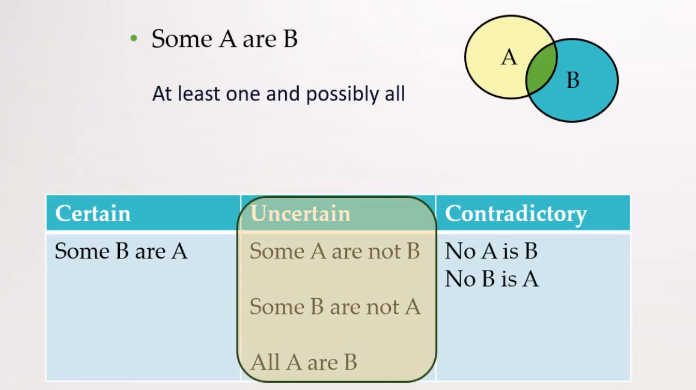
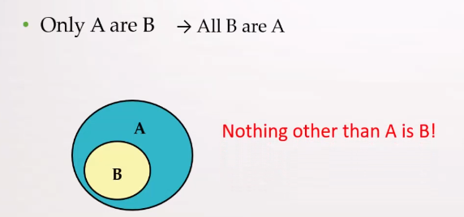
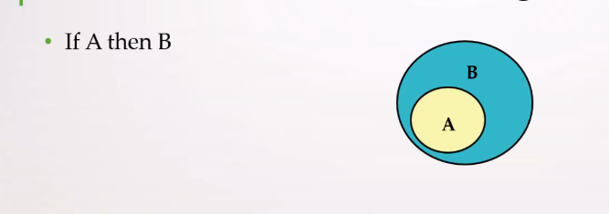

# Assumptions and conclusions — 12minprep

**Date:** Monday, 2026-08-10  
**Study started:** 09:46 (UTC-3)  
**Note:** 10:58 (UTC-3)

**Source:** [12minprep CCAT practice course](https://www.12minprep.com/courses/ccat-practice)

- Question format
- How to approach
- Solving tips

It is math with words

Premises -> Conclusion

Answer options:

- Correct (will always be correct, no exeptions)
- incorrect (will never be correct, no exceptions) -> conclusion contradicts a premise
- Cannot be determined (if can be correct or incorrect)

Quantifiers and their meanings

- All
- Some
- None
- If/then
- Every/whenever/either/or

### All

### Some

### Only

### If - then

You can assume that ALL A are B

### Statements into equations

### The middle term